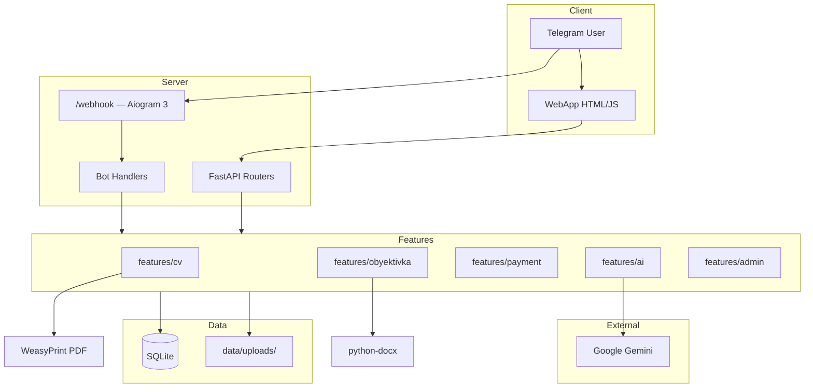

# HUJJATCHI AI — Production Audit & Refactor Report

**Sana:** 2026-06-22  
**Maqsad:** 5 modul (CV, Obyektivka, AI Voice, Manual Payment, Admin) — SQLite, Aiogram 3, FastAPI

---

## 1. Executive Summary

Loyiha **minimal production platform**ga qayta tuzildi:

| Modul | Holat | Output |
|-------|-------|--------|
| CV Generator | ✅ | PDF (WeasyPrint) |
| Obyektivka Generator | ✅ | DOCX (rasmiy layout saqlangan) |
| AI Voice Assistant | ✅ | Gemini STT + extraction |
| Manual Payment | ✅ | Kredit tizimi (1 to'lov = 1 generatsiya) |
| Admin Panel | ✅ | Telegram (Aiogram 3) |

**Olib tashlandi:** Supabase, Redis, Sentry, Playwright, python-telegram-bot, Premium/Subscription/Balance/Tarif

---

## 2. P0 / P1 / P2 Muammolar

### P0 — Kritik (hal qilindi yoki deploy da tekshirish kerak)

| # | Muammo | Holat |
|---|--------|-------|
| P0-1 | Ikki bot framework (PTB + aiogram) | ✅ Aiogram 3 ga migratsiya |
| P0-2 | Supabase dependency — production risk | ✅ SQLite |
| P0-3 | CV DOCX fallback (talab: faqat PDF) | ✅ PDF only export |
| P0-4 | Obyektivka PDF (talab: faqat DOCX) | ✅ DOCX only export |
| P0-5 | Playwright production og'irligi | ✅ Olib tashlandi |
| P0-6 | `config.py` vs `config/` package conflict | ✅ `config/` package |

### P1 — Muhim

| # | Muammo | Holat |
|---|--------|-------|
| P1-1 | WeasyPrint Windows da GTK kerak | ⚠️ Linux/Docker da `apt install` kerak |
| P1-2 | `google-generativeai` deprecated | ⚠️ `google.genai` ga migratsiya rejalashtirish |
| P1-3 | Eski `bot/` ichida Supabase referencelar | ⚠️ Ishlatilmaydi, keyingi sprintda tozalash |
| P1-4 | WebApp `app.js` — `/api/translate`, `/api/notify` dead routes | ⚠️ UI da chaqirilmasa muammo yo'q |

### P2 — Yaxshilash

| # | Muammo |
|---|--------|
| P2-1 | CV voice autofill WebApp UI da alohida tugma |
| P2-2 | Admin web panel (hozir faqat Telegram) |
| P2-3 | `ai_service.py` 1200+ LOC — faqat voice funksiyalariga qisqartirish |
| P2-4 | Unit testlar yangi SQLite layer uchun |

---

## 3. O'chiriladigan Fayllar

### To'liq o'chirish tavsiya (keyingi commit)

```
supabase/                          # 19 SQL fayl — SQLite ga migratsiya qilindi
SUPABASE_INTEGRATION.md
handlers/start.py                  # Legacy aiogram (root)
keyboards/menu.py
states/form.py
services/docx_service.py           # Root legacy
bot/handlers/admin_broadcast.py
bot/handlers/feedback.py
bot/handlers/contact.py
bot/handlers/premium.py            # → features/admin/
bot/handlers/my_documents.py
bot/handlers/admin.py
bot/handlers/service_intro.py      # → features/bot/
bot/handlers/obyektivka.py         # → features/bot/handlers/voice.py
backend/routers/documents_web.py   # → features/*/router.py
backend/routers/public_web.py      # → features/payment/router.py
backend/services/supabase_storage.py
backend/services/redis_json_cache.py
backend/services/web_user_quota.py
backend/services/web_quota.py
backend/services/export_guard.py
backend/redis_client.py
backend/sentry_init.py
backend/middleware/sentry_context.py
bot/services/supabase_db.py        # ~1600 LOC
user_profiles.json                 # → SQLite
usage_data.json
bot_settings.json
video_frame_*.png, speech.mp3      # Sample assetlar
```

### Saqlanadi (ishlatiladi)

```
templates/cv_template.html
templates/obyektivka_template.html
webapp/*
bot/services/ai_service.py         # Gemini (keyingi refactor)
bot/services/render_service.py     # HTML render
bot/services/obyektivka_docx_official.py
bot/services/document_render/*
bot/services/session_service.py
```

---

## 4. O'chiriladigan Dependencies

| Package | Sabab |
|---------|-------|
| `python-telegram-bot` | Aiogram 3 |
| `supabase` | SQLite |
| `redis` | Kerak emas |
| `sentry-sdk` | Kerak emas |
| `playwright` | WeasyPrint |
| `python-pptx` | OCR/translate olib tashlandi |
| `openpyxl` | Ishlatilmaydi |
| `reportlab` | WeasyPrint yetarli |
| `language-tool-python` | Spell check olib tashlandi |

**Yangi `requirements.txt`:** aiogram, fastapi, uvicorn, jinja2, python-docx, weasyprint, google-generativeai, Pillow, pydantic

---

## 5. Supabase → SQLite Migratsiya

### Mapping

| Supabase | SQLite |
|----------|--------|
| `users` | `users` (+ `credits`) |
| `payments` | `payments` |
| `paid_doc_requests` | `payments.id` = `request_id` |
| `pending_oby_json` | `obyektivka_data.pending_payload` |
| user profile fields | `cv_data`, `obyektivka_data` |
| Storage (cheklar) | `data/uploads/receipts/` |
| `bot_settings` | `settings` |
| `logs`, `action_logs` | Olib tashlandi (admin panel yetarli) |

### DB fayl

`data/hujjatchi.db` — WAL mode, foreign keys ON

---

## 6. Architecture Diagram



---

## 7. Database Schema

```sql
users (id, telegram_id UNIQUE, username, first_name, last_name, credits, created_at, updated_at)
payments (id, user_id FK, payer_name, card_number, receipt_path, status, admin_note, ...)
generated_files (id, user_id FK, file_type, file_path, file_name, ...)
cv_data (user_id PK FK, full_name, phone, email, address, birth_date, education, experience, skills, languages, extra)
obyektivka_data (user_id PK FK, payload JSON, pending_payload JSON)
ai_sessions (id, user_id FK, session_type, transcript, extracted_data, status, ...)
settings (key PK, value, updated_at)
```

---

## 8. AI Voice Architecture

```
Voice Message (Telegram / WebApp upload)
    ↓
ffmpeg normalize (OGG → MP3, optional)
    ↓
Gemini upload_file + generate_content (STT)
    ↓
extract_cv_data() / extract_obyektivka_data()
    ↓
SQLite: cv_data / obyektivka_data.pending_payload
    ↓
ai_sessions log
    ↓
WebApp autoload=1 → forma to'ldirilgan
    ↓
get_missing_*_fields() → faqat yetishmayotgan maydonlarni so'rash
```

---

## 9. Payment Architecture

```
User: Ism + Karta + Chek rasmi
    ↓
POST /api/request_paid_cv|obyektivka → payment PENDING (request_id)
    ↓
POST /api/paid_doc_submit_screenshot → receipt → data/uploads/receipts/
    ↓
Admin Telegram: ✅ Tasdiqlash / ❌ Rad etish
    ↓
APPROVED → users.credits += 1
    ↓
POST /api/export_cv|export_obyektivka → credits -= 1 → PDF/DOCX
    ↓
generated_files log
```

---

## 10. UI/UX

**Saqlangan:** `webapp/cv.html`, `webapp/obyektivka.html`, `theme.css`, `app.js`  
**Mobile-first:** Telegram WebApp SDK, responsive Tailwind (cv.html)  
**States:** Loading / Error / Success — mavjud `DastyorAI` SDK da  
**Keyingi qadam:** CV voice fill tugmasi WebApp da (`/api/cv_voice_fill`)

---

## 11. Security

| Himoya | Implementatsiya |
|--------|-----------------|
| Input validation | `core/security.py`, Pydantic schemas |
| File validation | `allowed_image()`, extension check |
| Rate limiting | `rate_limit()` per IP |
| SQL injection | Parameterized queries (sqlite3) |
| XSS | `html.escape()` + Jinja2 autoescape |
| Path traversal | `safe_path()` |
| Secrets | `.env` — `BOT_TOKEN`, `GOOGLE_API_KEY` commit qilinmasin |

---

## 12. Ishga Tushirish

```bash
# Local bot (polling)
python main.py

# Production (webhook + API)
uvicorn api_webhook:app --host 0.0.0.0 --port 8000
```

**Env:** `.env.example` ni nusxalang → `.env`

**Linux Docker (WeasyPrint):**
```dockerfile
RUN apt-get update && apt-get install -y \
    libpango-1.0-0 libpangocairo-1.0-0 libgdk-pixbuf2.0-0 \
    libffi-dev shared-mime-info
```

---

## 13. Folder Structure (Clean Architecture)

```
project/
├── main.py                 # Aiogram 3 polling
├── api_webhook.py          # ASGI entry
├── config/
├── core/
├── database/
│   ├── schema.sql
│   └── repositories/
├── features/
│   ├── cv/
│   ├── obyektivka/
│   ├── payment/
│   ├── ai/
│   ├── admin/
│   └── bot/handlers/
├── shared/
├── webapp/
├── templates/
└── data/                   # SQLite + uploads (gitignore)
```

---

## 14. Yakuniy Holat

| Talab | Bajarildi |
|-------|-----------|
| CV → PDF | ✅ |
| Obyektivka → DOCX | ✅ |
| AI Voice Auto Fill | ✅ |
| SQLite | ✅ |
| FastAPI | ✅ |
| Aiogram 3 | ✅ |
| Manual Payment + Kredit | ✅ |
| Admin Panel | ✅ |
| Supabase olib tashlandi | ✅ (kod migratsiya) |
| Dead dependencies | ✅ requirements.txt |
